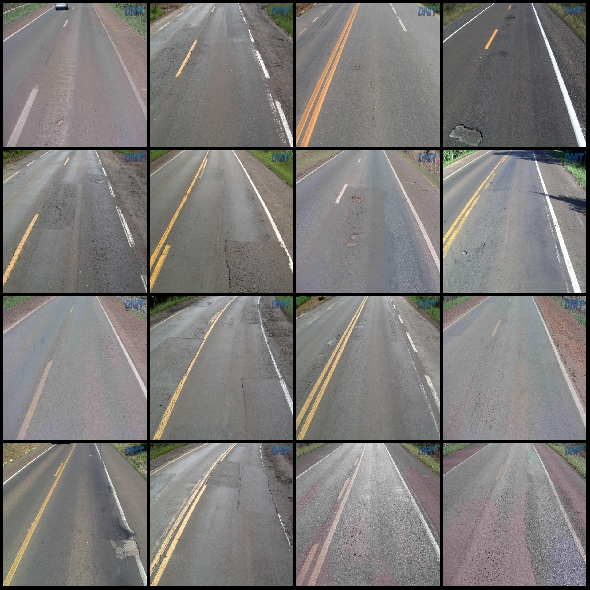
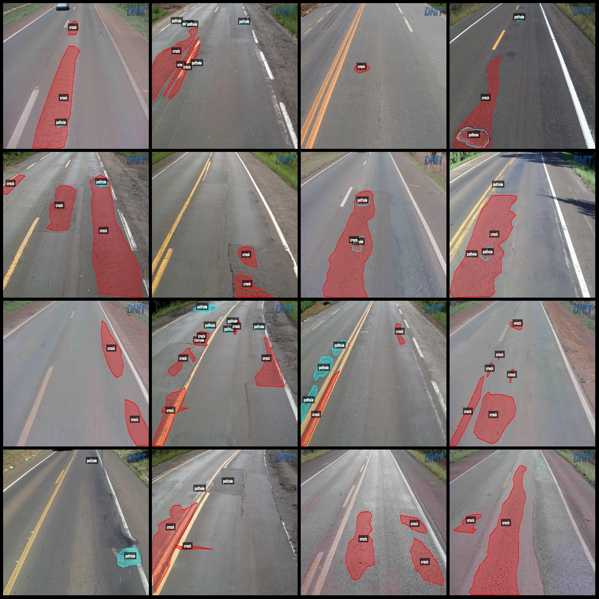
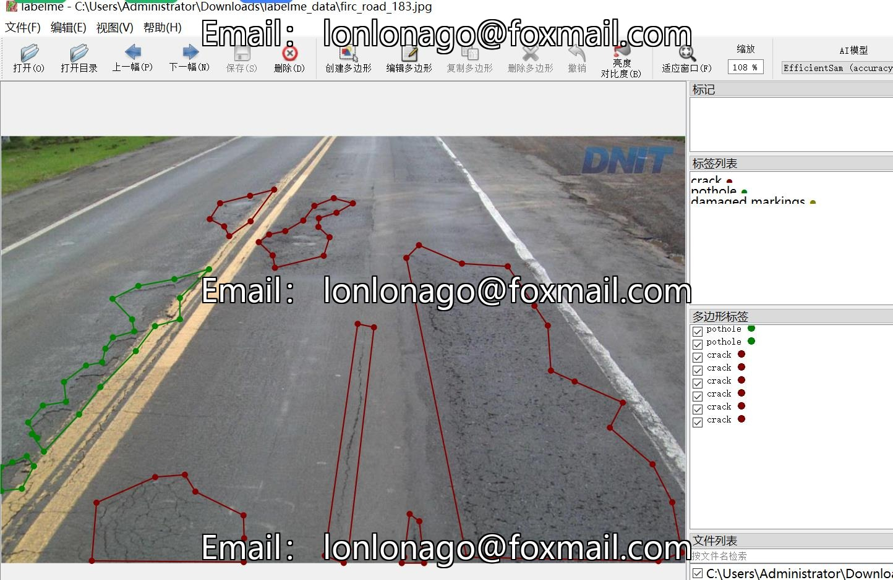

# Intelligent Transportation Roadway Cracks, Potholes, and Marking Damage Segmentation Dataset

**Dataset Format:** labelme format (without mask files, only containing jpg images and corresponding json files)

**Number of Images:** 1001 JPG files
**Number of Annotations:** 1001
**Number of Categories:** 4
**Category Names:** ["crack", "pothole", "damaged markings", "guardrail"]

**Box Count for Each Category:**
- Crack (cracks): count = 2202
- Pothole (pits/cracks): count = 1841
- Damaged Markings (markings damaged by potholes or cracks): count = 98
- Guardrail (railings): count = 10

**Total Boxes:** 4151

**Annotation Tool Used:** LabelMe v.5.5.0

**Image Resolution:** 1024x640

**Annotation Rules:** Polygons are drawn around the category for each image.

**Important Notices:** You can open and edit the dataset using LabelMe. For conversion to other formats such as mask, YOLOF, or COCO for instance segmentation or semantic segmentation, you need to 
convert the json dataset yourself.

**Special Disclaimer:** This dataset does not guarantee the accuracy of the trained models or weights files.

**Image Preview:**

**Example of Annotations:**

Randomly selected 16 images for annotation:

**Annotation drawing results:**

**LabelMe editing example:**

## Images

Here is a pay link on Stripe ( https://buy.stripe.com/3cs8yP7sY87d0vu9AB ). Please contact me lonlonago@foxmail.com after funding $89, and I will send you a complete data files , thank you!

